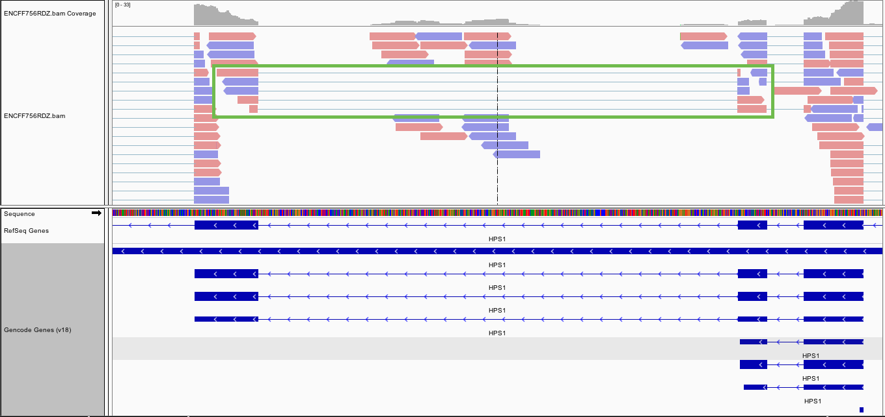

# junction-counter

Basically a few steps upstream of any splicing algorithm. It doesn't do
anything fancy like detect novel splice junctions, but it doesn't take that long to run.
If you just want to count reads supporting splice junctions
given an RNA-SEQ bam file and a spliced region,
you can use this tool to do it quickly:



Requirements:

Refer to the 'environments.yaml' file for the conda env I tested with, or create your own:
```
conda create -n jxc python=2.7 samtools=1.4.1 pysam=0.11.2 tqdm pandas
conda install -c conda-forge bzip2
```

Then run:
```
source activate jxc
git clone https://github.com/byee4/junction-counter
python setup.py build
python setup.py install
```

Usage:

Refer to the bash script run_junction_counter.sh

```
count-junctions \
--bed data/intron_jxnlist.bed \     # bedfile containing introns (NOTE: make sure these are 0-based BED files of introns)
--bam ENCFF756RDZ.bam \             # alignment bam file
--outfile data/output.txt \         # output file
--min_overlap 1 \                   # requires each read to cover this many bases to be counted as supporting either intron or exon.
--jxc_only \                        # count only reads spanning junctions
--report_names                      # report the names of all reads (WARNING: this might make the file BIG)
```

# More stuff

You can download the BAM file [here](https://www.encodeproject.org/files/ENCFF756RDZ/@@download/ENCFF756RDZ.bam)
 (make sure to index this as well!)

## More more stuff

##### Methods:
- (splice = supports this junction, not-spliced = doesn't support it)
- gather every read that falls between the spliced region (if chr1:10-20 was specified as the intron, our area of interest is 9 to 21)
- filter out any read that is either: not properly paired, failed qc, isn't a primary alignment
- use the read's CIGAR string to check whether or not a split "stops" at the left exon (eg read goes from 4-9)
- use the read's CIGAR string to check whether or not a split "stops" at the right exon (eg read goes from 21-25)
- use the read's CIGAR string to determine whether or not the read lies somewhere between (eg 13-19)
- if a read supports the junction site from both left and right sides, +1 'splice'
- if a read supports a junction site from just one side but not the other, +1 'not-spliced' (although this read probably supports a different splice junction, not just this one)
- if a read lies totally within the junction, +1 'notspliced' as well.